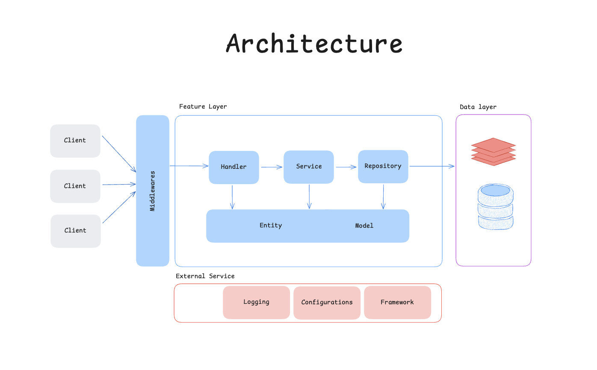

# Banking API 

## Table of Contents
- [**Getting Started**](#1-getting-started)
- [**System Architecture**](#system-architecture)
- [**Project Structure**](#project-structure)
- [**Core Components**](#core-components)
- [**Key Features**](#key-features)
- [**Design Principles**](#2-design-principles)
- [**Authentication Flow**](#3-authentication-flow)
- [**API Reference**](#4-api-reference)
- [**Test Summary**](#5-test-summary)

---

## System Overview

Banking API เป็นระบบ Backend API สำหรับ Banking Application ที่ใช้ Go (Golang) และ Fiber Framework พัฒนาด้วยสถาปัตยกรรม Clean Architecture และ Repository Pattern

## System Architecture Diagram


## Project Structure

```
banking-api/
├── src/                      # Source code
│   ├── app/                  # Application layer
│   │   ├── entities/         # Domain entities
│   │   ├── features/         # Feature modules
│   │   │   ├── auth/         # Authentication system
│   │   │   ├── home/         # Dashboard features
│   │   ├── models/           # Database models
│   │   └── validators/       # Input validation
│   ├── cmd/                  # CLI commands
│   ├── config/               # Configuration
│   ├── database/             # Database layer
│   │   └── migrations/       # Schema migrations
│   ├── logger/               # Logging setup
│   ├── server/               # HTTP server
│   │   ├── middlewares/      # HTTP middleware
│   │   ├── response/         # Response utilities
│   │   └── routes/           # Route configuration
│   └── main.go               # Application entry
├── stress_test/              # Performance tests
```
## Core Components
### 1. HTTP Server (Fiber Framework)
- **Port**: Configurable (default: 8080)
- **Framework**: Go Fiber v2
- **Features**: High performance

### 2. Middleware Layer
- **Auth Middleware**: JWT token validation and user authentication
- **Logger Middleware**: Request/response logging with request ID
- **Error Handler**: Centralized error handling
- **Token Ban Middleware**: Validate banned tokens

### 3. Handler Layer
- **Auth Handler**: Authentication endpoints (login, refresh, token management)
- **Home Handler**: Home screen data aggregation
- **User Handler**: User profile management

### 4. Service Layer (Business Logic)
- **Auth Service**: Authentication business logic
- **JWT Service**: Token generation, validation, and refresh
- **Home Service**: Home data aggregation logic
- **User Service**: User management logic

### 5. Repository Layer (Data Access)
- **Auth Repository**: User authentication data access
- **Home Repository**: Home screen data access
- **User Repository**: User profile data access

### 6. Database Layer
- **MySQL**: Primary database for persistent data
- **Redis**: Caching layer for sessions and temporary data


## Key Features

### 1. Authentication System
- PIN-based authentication
- JWT access and refresh tokens
- Token versioning and banning
- Failed attempt tracking with lockout mechanism

### 2. Home Screen API
- User profile aggregation
- Account balance summaries
- Recent transactions
- Banking cards information
- Promotional banners

### 3. Security Features
- JWT token validation with ban checking
- Request rate limiting
- Input validation

### 4. Monitoring & Logging
- Structured logging with Zap
- Request ID tracking
- Error tracking