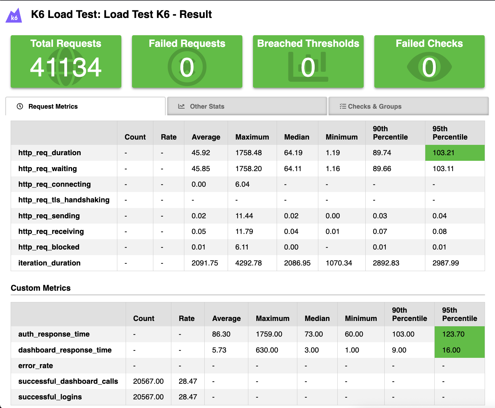

# Banking API Service

A high-performance banking API service built with Go, featuring secure authentication, real-time account management, and comprehensive transaction handling. This project follows Clean Architecture principles to ensure maintainability, scalability, and testability.

## Key Features

**Secure Authentication**
- PIN-based authentication with JWT tokens
- Refresh token mechanism
- Brute-force protection with exponential backoff

**Dashboard Account**
- Multi-account support
- Real-time balance tracking
- Account flags and customization
- Debit card information
- Card status 
- Customizable card design

---

## Tech Stack

- **Language:** [Go 1.24.5](https://golang.org/)
- **Web Framework:** [Fiber v2](https://gofiber.io/)
- **Database:** [MySQL 8.0](https://www.mysql.com/)
- **ORM:** [GORM](https://gorm.io/)
- **Authentication:** [JWT](https://jwt.io/)
- **CLI:** [Cobra](https://github.com/spf13/cobra)
- **Configuration:** [Viper](https://github.com/spf13/viper)
- **Logging:** [Zap](https://github.com/uber-go/zap)
- **Validation:** [Validator](https://github.com/go-playground/validator)
- **Containerization:** [Docker](https://www.docker.com/) & [Docker Compose](https://docs.docker.com/compose/)

## Prerequisites

- [Go](https://golang.org/doc/install) (version 1.24.5 or higher)
- [Docker](https://docs.docker.com/get-docker/)
- [Docker Compose](https://docs.docker.com/compose/install/)

## Getting Started

### 1. Clone the Repository

```bash
git clone https://github.com/Testzyler/banking-api.git
cd banking-api
```

### 2. Download Mock Data

Download the mock data and store it in the seeds directory:

```bash
# Create seeds directory if it doesn't exist
mkdir -p src/database/migrations/seeds

# Download mock data (replace with actual URL)
curl -L "https://https://drive.google.com/file/d/1hGppnGIvL09eHmZ_EXFwNYL1Jj_axjId/view?usp=drive_link" \
  -o src/database/migrations/seeds/*.sql

# Or if you have the mock data file locally, copy it:
# cp /path/to/your/mock_data.sql src/database/migrations/seeds/
```

### 3. Set up Docker Environment Variables

Create a `.env` file in the root directory:

```bash
# Database Configuration
MYSQL_ROOT_PASSWORD=rootpassword
MYSQL_DATABASE=banking
MYSQL_USER=banking_user
MYSQL_PASSWORD=userpassword

# Application Configuration
PORT=8080
```

### 4. Configure the Application

Copy the example configuration file and update it with your database credentials if needed.

```bash
cp src/config.example.yaml src/config.yaml
```

### 5. Start the Services

Run all services using Docker Compose:

```bash
docker-compose up -d --build
```

This will start:
- MySQL database
- Database migrations  - always check for new migrations is added (first time would be take several times to start because it's take seeds into database)
- Banking API service - start after migration completed

### 6. Verify Installation

Check if the API is running:

```bash
curl http://localhost:8080/healthz
```

### 7. Local Development Setup

For local development without Docker:

```bash
# Navigate to source directory
cd src

# Install dependencies
go mod download

# Run migrations
go run . migrate

# Start the API server
go run . serve_api
```

## API Documentation

Base URL: `http://localhost:8080`

### Authentication Endpoints

#### Verify PIN

Authenticate user using their PIN and receive JWT tokens.

```http
POST /auth/verify-pin
```

**Request Body:**
```json
{
  "user_id": "string",
  "pin": "string" // default for mock "123456"
}
```

**Response:**
```json
{
  
    "code": 10200,
    "message": "PIN verified successfully",
    "data": {
        "token": "eyJhbGciOiJIUzI1NiIsInR5cCI6IkpXVCJ9...",
        "expiry": "2025-08-01T05:44:00.106492252Z",
        "refreshToken": "eyJhbGciOiJIUzI1NiIsInR5cCI6IkpXVCJ9...",
        "userID": "0001603be1a211ef95a30242ac180002",
        "name": "User_0001603be1a211ef95a30242ac180002",
        "greeting": ""
    }
}
```

#### Refresh Token

Get new access token using refresh token.

```http
POST /auth/refresh
```

**Request Body:**
```json
{
  "refreshToken": "string"
}
```

### Dashboard Endpoints

#### Get Dashboard Data

Retrieve user's banking dashboard information including accounts, balances, and cards.

```http
GET /dashboard/accounts
```

**Headers:**
```
Authorization: Bearer {access_token}
```

**Response:**
```json

  {
    "code": 10200,
    "message": "Dashboard data retrieved successfully",
    "data": {
        "userID": "0001xxx",
        "name": "User_0001xxx",
        "greeting": "Hello User_0001xxx",
        "debitCards": [...],
        "banners": [...],
        "transactions": [...],
        "accounts": [...],
        "totalBalance": 36738.53
    }
}

```

### Response Format

#### Success Response
```json
{
  "code": 102xx,
  "message": "Operation completed successfully",
  "data": { ... }
}
```

#### Error Response
```json
{
  "code": 104xx - 106xx,
  "message": "Error description",
  "details": "Detailed error information"
}
```

#### HTTP Status Codes

| Status Code | Description |
| :---------- | :---------- |
| `200`       | Success |
| `400`       | Bad Request |
| `401`       | Unauthorized |
| `403`       | Forbidden |
| `404`       | Not Found |
| `500`       | Internal Server Error |


### User Endpoints

#### Get All Users

Retrieve paginated list of users with search functionality.

```http
GET /users?page=1&perPage=10
```

| Parameter | Type     | Description                        |
| :-------- | :------- | :--------------------------------- |
| `page`    | `integer` | Page number (default: 1)          |
| `perPage` | `integer` | Items per page (default: 10)      |

**Response:**
```json
{
  "code": 10200,
  "message": "User retrieved successfully",
  "data": [...],
  "meta": {
        "page": 1,
        "perPage": 100,
        "total": 1000000,
        "totalPages": 10000,
        "hasNext": true,
        "hasPrevious": false
    }
}
```

#### Get User by ID

Retrieve specific user information.

```http
GET /users/{id}
```

| Parameter | Type     | Description                       |
| :-------- | :------- | :-------------------------------- |
| `id`      | `string` | **Required**. User ID to fetch   |


## Database Schema

The database consists of the following main tables:

### Core Tables
- **`users`** - User basic information
- **`user_greetings`** - Personalized user greetings

### Account Management
- **`accounts`** - Account information
- **`account_balances`** - Real-time balance tracking
- **`account_details`** - Account configuration
- **`account_flags`** - Account feature flags

### Card Management
- **`debit_cards`** - Basic card information
- **`debit_card_details`** - Card numbers and issuer info
- **`debit_card_status`** - Card status tracking
- **`debit_card_design`** - Card design customization

### Transaction & UI
- **`transactions`** - Transaction records
- **`banners`** - UI banner content

## Project Structure

```
banking-api/
├── src/                          # Source code
│   ├── app/                      # Application layer
│   │   ├── entities/             # Domain entities
│   │   ├── features/             # Feature modules
│   │   │   ├── auth/             # Authentication
│   │   │   ├── users/            # User management
│   │   │   └── dashboard/        # Dashboard
│   │   ├── models/               # Database models
│   │   └── validators/           # Input validators
│   ├── cmd/                      # CLI commands (Cobra)
│   ├── config/                   # Configuration reader
│   ├── database/                 # Database layer
│   │   └── migrations/           # Database migrations
│   ├── logger/                   # Logging configuration
│   ├── server/                   # HTTP server setup
│   │   ├── middlewares/          # HTTP middlewares
│   │   ├── response/             # Response utilities
│   │   └── routes/               # Route registration
│   └── main.go                   # Application entry point
├── stress_test/                  # Performance testing
├── schema.sql                    # Database schema for initialization
└── docker-compose.yaml           # Docker services
```

## Testing

### Performance Testing

The project includes comprehensive stress testing using k6 with multiple load scenarios testing authentication and dashboard endpoints.

#### Test Scenarios

**1. Light Load Test**
- **Virtual Users**: 10 concurrent users
- **Duration**: 1 minute
- **Purpose**: Baseline performance validation

**2. Normal Load Test** 
- **Virtual Users**: Ramp 0→20→0 over 5 minutes
- **Pattern**: 1min ramp-up, 3min steady, 1min ramp-down
- **Purpose**: Typical usage simulation

**3. Heavy Load Test**
- **Virtual Users**: Ramp 0→100→0 over 12 minutes  
- **Pattern**: 2min→50, 5min steady, 2min→100 peak, 2min→50, 1min→0
- **Purpose**: Stress testing and capacity planning

#### Test Coverage
- **Authentication Flow**: PIN verification + JWT token generation
- **Dashboard API**: Account data retrieval with authorization
- **Error Handling**: Invalid credentials and timeout scenarios
- **Response Time Monitoring**: Custom metrics for auth and dashboard endpoints

#### Performance Results

```bash
# Run stress tests
cd stress_test
k6 run stress-test.js
```

**Test Summary:**
- ✅ **20,567 iterations** completed (28.47 iterations/sec)
- ✅ **41,134 HTTP requests** processed (56.93 requests/sec)  
- ✅ **102,835 checks passed** (100% success rate)
- ✅ **0 failed requests** (0% error rate)
- 📊 **Max 100 concurrent users** handled successfully

**Response Time Performance:**
- **Average Response Time**: 45.92ms
- **Maximum Response Time**: 1,758ms
- **Median Response Time**: 64.19ms
- **95th Percentile**: <2,000ms (within SLA)

**Throughput:**
- **Data Received**: 76.96 MB (0.11 MB/s)
- **Data Sent**: 16.66 MB (0.02 MB/s)
- **Network Efficiency**: Optimized JSON responses

**Performance Thresholds Met:**
- ✅ 95% of dashboard requests < 2,000ms
- ✅ 95% of auth requests < 500ms  
- ✅ Error rate < 5% (achieved 0%)
- ✅ HTTP request duration 95th percentile < 3,000ms



**Database Under Load:**
- **25,000 test users** from users.txt
- **MySQL connection pooling** handled concurrent access
- **GORM optimized queries** maintained performance
- **Transaction integrity** preserved under stress

### Unit Testing

```bash
# Run all tests
cd src
go test ./...

# Run tests with coverage
go test -cover ./...

# Run specific package tests
go test ./app/features/users/...
```

## Available Commands

```bash
# Start API server
go run . serve_api

# Run database migrations
go run . migrate

# Show help
go run . --help
```

## Environment Configuration

The application supports different environments:

- **Development**: `config.yaml`
- **Docker**: `config.docker.yaml`
- **Production**: Environment variables

### Key Configuration Options

```yaml
Server:
  Port: 8080
  Environment: development
  
Database:
  Host: localhost
  Port: 3306
  Username: banking_user
  Password: userpassword
  Name: banking
  
Logger:
  Level: info
  LogColor: true
  LogJson: false
```

## Security Features

**PIN Authentication**
- Secure PIN hashing with bcrypt
- Brute-force protection
- Exponential backoff retry mechanism

**JWT Token Management**
- Access and refresh token system
- Token expiration handling

**Input Validation & Security**
- Comprehensive request validation with go-playground/validator
- SQL injection prevention through GORM parameterized queries
- JSON-only API responses (inherent XSS protection)
- CORS middleware configuration
- URL parameter escaping

## Deployment

### Docker Deployment

```bash
# Production deployment
docker-compose -f docker-compose.yaml up -d

# Check service status
docker-compose ps

# View logs
docker-compose logs -f banking-api
```

### Health Checks

The application provides health check endpoints:

```bash
# Application health
curl http://localhost:8080/healthz
```

## Additional Resources

- [Fiber Documentation](https://docs.gofiber.io/)
- [GORM Documentation](https://gorm.io/docs/)  
- [JWT Best Practices](https://auth0.com/blog/a-look-at-the-latest-draft-for-jwt-bcp/)
- [Go Testing](https://golang.org/pkg/testing/)
- [Exponential backoff](https://cloud.google.com/memorystore/docs/redis/exponential-backoff)