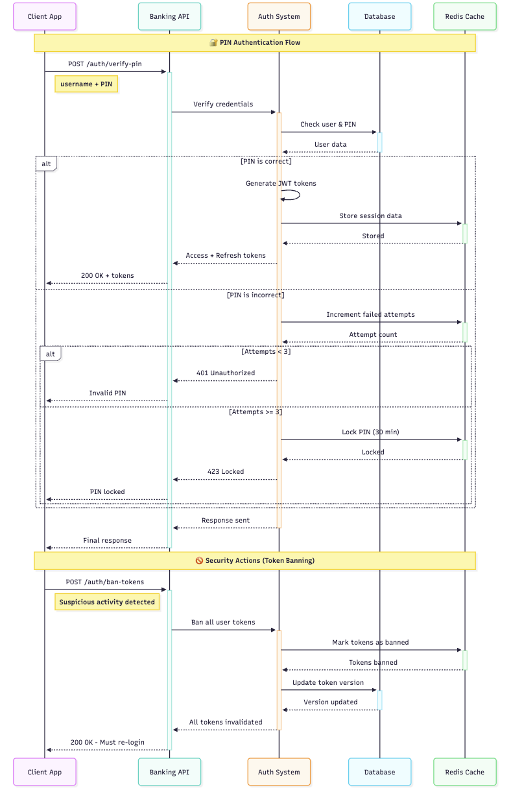

# Authentication Flow - Banking API

## Authentication Overview Diagram

## Authentication Flow Summary

### 🔐 Authentication Scenarios

#### ✅ **Success Flows**
1. **Login Success**
   - User provides correct username + PIN
   - System generates JWT access token (15 min) + refresh token (24 hours)
   - Tokens stored securely for session management
   - User gains access to protected resources

2. **Token Refresh Success**
   - User presents valid refresh token
   - System generates new access token
   - Session continues without re-login

3. **Protected Access Success**
   - User sends valid access token in Authorization header
   - System validates token (not expired, not banned)
   - Request processed and data returned

#### ❌ **Failure Flows**
1. **Login Failures**
   - **Wrong PIN (< 3 attempts)**: Returns `401 Unauthorized`
   - **Wrong PIN (≥ 3 attempts)**: PIN locked for 30 minutes, returns `423 Locked`
   - **Account not found**: Returns `401 Unauthorized`

2. **Token Failures**
   - **Expired Token**: Returns `401 Unauthorized` - client should use refresh token
   - **Banned Token**: Returns `401 Unauthorized` - client must re-login
   - **Invalid Token**: Returns `401 Unauthorized` - client must re-login

3. **Security Actions**
   - **Suspicious Activity**: All user tokens banned, requires fresh login
   - **Token Versioning**: Old tokens invalidated when security event occurs

### 🛡️ Security Features

- **PIN Lockout**: 3 failed attempts = 30-minute lockout
- **Token Expiry**: Short-lived access tokens (15 min) for security
- **Token Banning**: Immediate token invalidation capability
- **Version Control**: Token versioning prevents replay attacks
- **Rate Limiting**: Protection against brute force attacks

### 📊 Response Codes
- `200 OK`: Successful authentication/refresh/access
- `401 Unauthorized`: Invalid credentials, expired tokens, banned tokens
- `423 Locked`: PIN temporarily locked due to failed attempts
- `422 Unprocessable Entity`: Invalid request format

## Key Components

### 🏗️ **System Architecture**
- **Client App**: Mobile/Web application
- **Banking API**: Main API server (Fiber framework)
- **Auth System**: Authentication service layer
- **Database**: MySQL for persistent data
- **Redis Cache**: Session storage and rate limiting

### 🔑 **Token Management**
- **Access Token**: 15-minute expiry for API access
- **Refresh Token**: 24-hour expiry for token renewal
- **Token Versioning**: Prevents old token reuse
- **Ban System**: Immediate token invalidation

### 🚨 **Security Mechanisms**
- **PIN Authentication**: 6-digit PIN verification
- **Attempt Limiting**: Max 3 failed attempts before lockout
- **Token Validation**: Multi-layer token verification
- **Session Management**: Secure session handling with Redis
