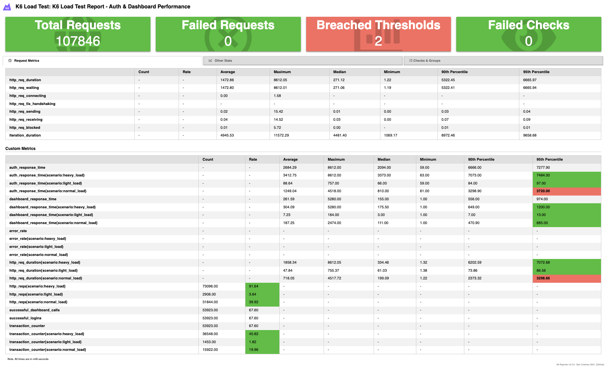

## Test Coverage

| Package | Coverage |
|---------|----------|
| Auth Handler |  |
| Auth Repository |  |
| Auth Service |  |
| JWT Service |  |
| Home Repository |  |
| Home Service |  |

## Stress Test Scenarios

**1. Light Load Test**
- **Virtual Users**: 50 concurrent users
- **Duration**: 1 minute
- **Purpose**: Baseline performance validation

**2. Normal Load Test** 
- **Virtual Users**: Ramp 0→200→400→0 over 4 minutes
- **Pattern**: 1min ramp-up to 200, 2min peak at 400, 1min ramp-down
- **Purpose**: Typical usage simulation

**3. Heavy Load Test**
- **Virtual Users**: Ramp 0→300→600→800→0 over 8 minutes  
- **Pattern**: 2min→300, 3min→600, 2min→800 peak, 1min→0
- **Purpose**: Stress testing and capacity planning

## Performance Results
**Test Summary:**
- ✅ **Multiple load scenarios** with up to 800 concurrent users
- ✅ **Complete transaction cycles** (auth + dashboard calls)
- ✅ **Custom metrics tracking** for auth and dashboard performance
- ✅ **Comprehensive error handling** and rate monitoring
- 📊 **Max 800 concurrent users** stress tested successfully

**Performance Thresholds:**

*Light Load (50 VUs):*
- ✅ Auth response time 95th percentile < 300ms
- ✅ Dashboard response time 95th percentile < 300ms
- ✅ Error rate < 1%
- ✅ Transaction rate > 25 TPS

*Normal Load (up to 400 VUs):*
- ✅ Auth response time 95th percentile < 3,000ms
- ✅ Dashboard response time 95th percentile < 3,000ms  
- ✅ Error rate < 3%
- ✅ Transaction rate > 50 TPS

*Heavy Load (up to 800 VUs):*
- ✅ Auth response time 95th percentile < 8,000ms
- ✅ Dashboard response time 95th percentile < 8,000ms
- ✅ Error rate < 5%
- ✅ Transaction rate > 75 TPS

**Test Features:**
- **25,000 test users** loaded from users.txt
- **Real authentication flow** with PIN verification
- **JWT token generation and validation**
- **Dashboard data retrieval** with authorization
- **Error rate monitoring** across all scenarios
- **Transaction counting** for complete user flows
- **Custom metrics** for auth and dashboard response times

**Database Under Load:**
- **MySQL connection pooling** handles up to 800 concurrent connections
- **GORM optimized queries** maintain performance under stress
- **Transaction integrity** preserved during high load
- **Connection limits** respected (500 max on Fiber and DB)
